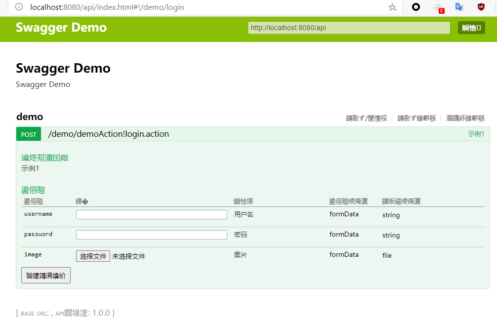
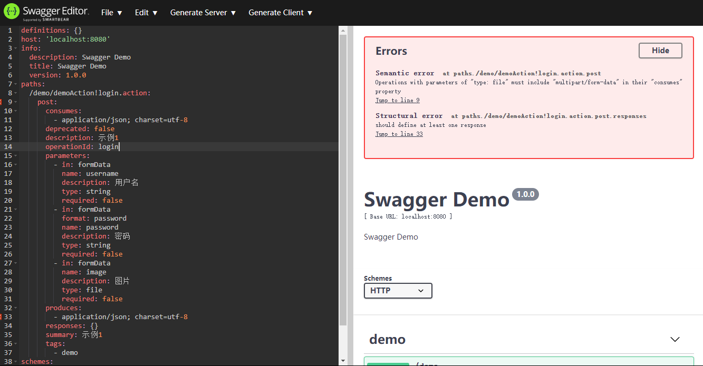

# Struts2 & Swagger

## 变动

1. struts2升级到了最新的`2.5.26`版本
2. 通过jetty运行，插件版本用的`9.4.29.v20200521`
3. swagger4j升级到了`2.2.1`（以及它的依赖库）

## 进展

- [x] 纯文字API解析OK http://localhost:8080/api/ 
- [x] 可视化路径 ~~http://localhost:8080/doc/index.html~~ http://localhost:8080/api/index.html

> 啊，我才发现这个关系，我把`web.xml`里的swagger对应的Filter匹配到`/api/`上，现在正常显示了一个API倒是

### 问题

- [ ] `api`返回的json，放入SwaggerEditor中语法有一定问题
- [ ] `/api/index.html`下的文字是乱码

## 最好能完成

- [ ] 在Struts`2.5.26`下用上`Swagger`，有稳定的可视化的接口文档（快了）
- [ ] 在上个条件下，下钻到JDK1.7的支持（最好能实现）
- [ ] `Struts1`的支持（issue区里也看到有人提这个，但感觉太难完成了）

